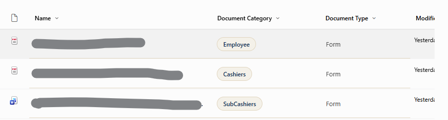

# SharePoint JSON Formatting

Reusable JSON formatting samples for SharePoint Online lists and document libraries used by the Cashiering Services intranet.

## Repository structure

```text
exchange-information/
  README.md
  exchange-information-view.json
  assets/
    exchange-information-preview.png

document-library/
  view-formatting.json
  name-column-with-icon.json
  name-column-no-icon.json
  document-category-column.json
  document-type-column.json
  modified-column.json

DocumentLibraryFormat.png
```

## Document library preview

The following example shows the document library after applying the view and column formatting files:



## Document library fields

The document-library samples expect these SharePoint fields:

- `FileLeafRef` / Name: file name
- `FileRef`: document URL
- `DocumentCategory`: business category
- `DocumentType`: document nature, such as Form, Policy, Regulation, or SOP
- `Modified`: last modified date

Add the fields to the selected view before applying column formatting. Internal field names must match the JSON references.

## Applying the files

### View formatting

1. Open the document library.
2. Select **View options > Format current view**.
3. Choose **Advanced mode**.
4. Paste `document-library/view-formatting.json`.

### Column formatting

1. Open the column menu.
2. Select **Column settings > Format this column**.
3. Choose **Advanced mode**.
4. Paste the JSON file matching the column.

For the Name column, use only one variant:

- `name-column-with-icon.json`: use this after hiding the native **Type** column from the view.
- `name-column-no-icon.json`: use this when keeping the native **Type** column visible.

## Exchange Information

The Exchange Information sample is available in:

```text
exchange-information/exchange-information-view.json
```

See `exchange-information/README.md` for the preview, expected fields, and installation instructions.

## Design palette

- Navy: `#0B2D55`
- Champagne background: `#F5F1E8`
- Champagne border: `#E2D5BC`
- Neutral text: `#605E5C`
